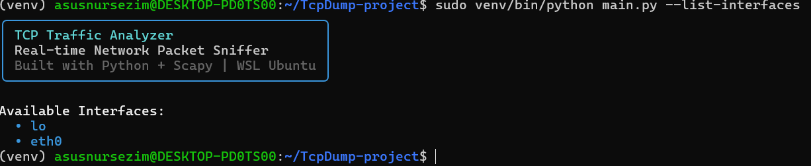
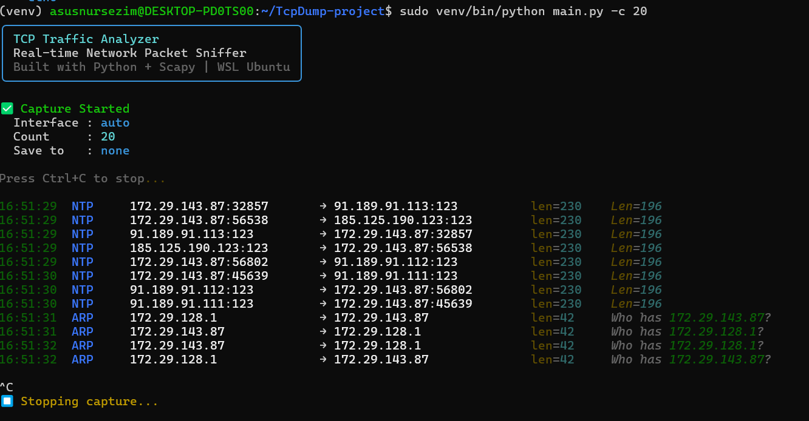
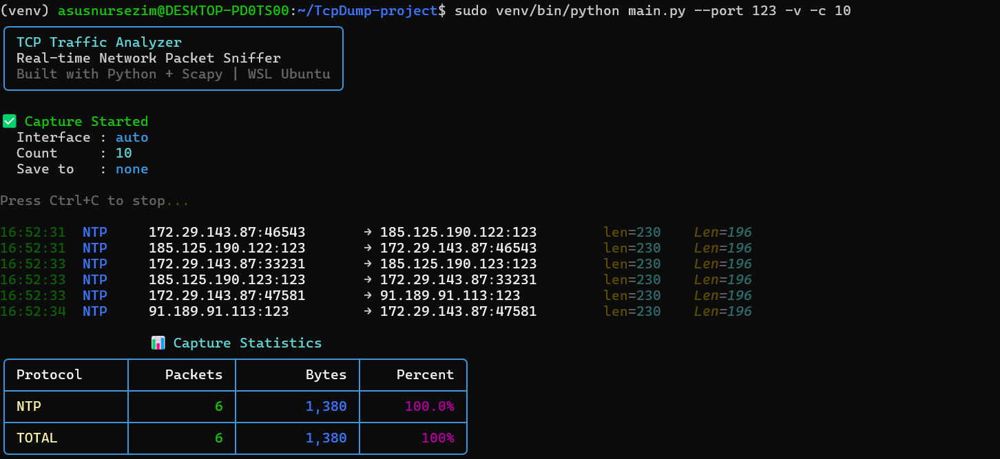
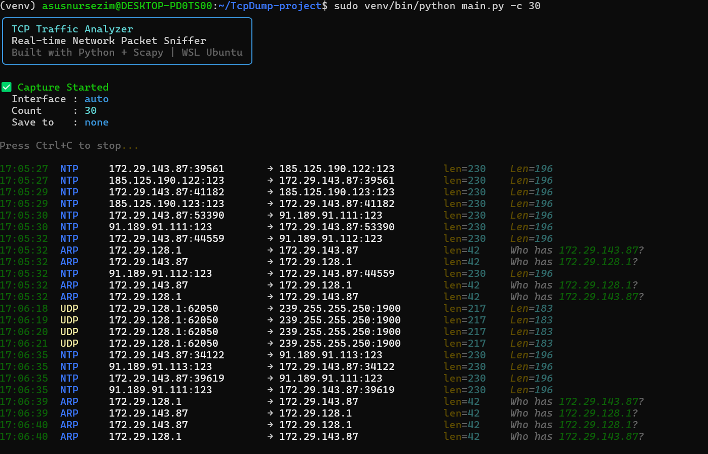

# 🔬 Network Forensics & Traffic Analysis Lab


---

## 🎯 Objective

This project aimed to build a controlled environment for capturing,
inspecting, and analyzing network traffic using a custom-built
**Python CLI tool** powered by **Scapy**, running on **WSL Ubuntu**.

The primary focus was to capture live packets, identify protocol behavior,
apply filters to isolate specific traffic types, analyze packet structure,
and document findings in structured security reports.

This hands-on lab was designed to strengthen practical skills in
**network forensics**, **packet analysis**, and **threat identification** —
core competencies for a **SOC Analyst** role.

---

## 🧠 Skills Learned

- Practical understanding of **packet capture** and **network forensics** methodology
- Ability to filter, inspect, and interpret **raw network traffic** using Python + Scapy
- Proficiency in identifying protocol behavior: **NTP, ARP, TCP, UDP, DNS, ICMP**
- Understanding of **TCP/IP stack** — how packets travel through network layers
- Building a **CLI security tool** from scratch using Python
- Development of structured **security reporting** and documentation skills
- Critical thinking and investigative mindset applied to **real network data**
- Using **virtual environments** and managing Python dependencies in WSL Ubuntu

---

## 🛠️ Tools Used

| Tool         | Purpose                                          |
|--------------|--------------------------------------------------|
| Python 3.14  | Main programming language for the CLI tool       |
| Scapy 2.7.0  | Raw packet capture, parsing, and analysis        |
| Rich 15.0.0  | Colored terminal output and statistics tables    |
| Click 8.4.2  | CLI argument and filter handling                 |
| WSL Ubuntu   | Linux environment running on Windows 11          |
| Git          | Version control and project management           |
| GitHub       | Project hosting and documentation                |

---

## 📁 Project Structure

```
TcpDump-project/
├── main.py            # Entry point — CLI commands and options
├── capture.py         # Packet capture engine (sniff + stats)
├── parser.py          # Packet parser — decodes each layer
├── filters.py         # Filter logic — protocol, IP, port
├── display.py         # Terminal display — colors and tables
├── requirements.txt   # Python dependencies
└── screenshots/       # Terminal screenshots from live capture
    ├── 01_interfaces.png
    ├── 02_all_traffic.png
    ├── 03_ntp_filter.png
    └── 04_statistics.png
```

---

## ⚙️ Installation & Setup

```bash
# Step 1 — Clone the repository
git clone https://github.com/nursezimtoikulova-sketch/TcpDump-project.git
cd TcpDump-project

# Step 2 — Create virtual environment
python3 -m venv venv
source venv/bin/activate

# Step 3 — Install dependencies
pip install scapy rich click

# Step 4 — Run the tool
sudo venv/bin/python main.py --list-interfaces
```

---

## 🔬 Step 1 — Setting Up the Environment

Configured the analysis environment on **WSL Ubuntu (Windows 11)**.
Built a custom Python CLI packet sniffer using **Scapy** library.
Verified that raw socket access works correctly with `sudo`.

### 📸 Screenshot — Tool Banner & Interfaces



| Interface | Type      | Description                      |
|-----------|-----------|----------------------------------|
| lo        | Loopback  | Internal loopback (127.0.0.1)    |
| eth0      | Ethernet  | Main WSL network interface       |

---

## 🔬 Step 2 — Capturing Live Traffic

Used the custom TCPDump CLI tool to capture live packets
on the network interface.

```bash
# Capture 20 packets
sudo venv/bin/python main.py -c 20

# Equivalent classic TCPDump command:
sudo tcpdump -i eth0 -c 20 -w capture.pcap
```

### 📸 Screenshot — Live Packet Capture



### 📦 Packet Analysis — NTP

| Field              | Details                              |
|--------------------|--------------------------------------|
| 🔢 Protocol        | NTP — Network Time Protocol          |
| 📥 Port            | 123 (UDP)                            |
| 🌐 Source IP       | 172.29.143.87 (local WSL device)     |
| 🌍 Destination     | 91.189.91.113 (Ubuntu NTP server)    |
| 📏 Frame Size      | 230 bytes                            |
| 📦 Payload         | 196 bytes                            |
| 📋 Purpose         | System clock synchronization         |

### 📦 Packet Analysis — ARP

| Field              | Details                                          |
|--------------------|--------------------------------------------------|
| 🔢 Protocol        | ARP — Address Resolution Protocol               |
| 🌐 Source IP       | 172.29.143.87 (local WSL device)                |
| 🌍 Target IP       | 172.29.128.1 (default gateway)                  |
| 📏 Frame Size      | 42 bytes                                         |
| 📋 ARP Message     | Who has 172.29.128.1? Tell 172.29.143.87        |
| 📋 Purpose         | MAC address discovery on local LAN               |

---

## 🔬 Step 3 — Protocol Filtering & Deep Analysis

Applied protocol-specific filters to isolate individual traffic types.

```bash
# Filter NTP traffic on port 123 with verbose output
sudo venv/bin/python main.py --port 123 -v -c 10
```

### 📸 Screenshot — NTP Filter (Port 123)



### 🔍 NTP Deep Analysis

| Field              | Details                              |
|--------------------|--------------------------------------|
| 🔢 Protocol        | NTP over UDP                         |
| 📥 Port            | 123                                  |
| 📊 Packets         | 6 captured                           |
| 📏 Total Bytes     | 1,380 bytes                          |
| 🌍 NTP Server 1    | 91.189.91.111 (Ubuntu NTP pool)      |
| 🌍 NTP Server 2    | 91.189.91.112 (Ubuntu NTP pool)      |
| 🌍 NTP Server 3    | 91.189.91.113 (Ubuntu NTP pool)      |
| 🌍 NTP Server 4    | 185.125.190.122 (Ubuntu NTP pool)    |
| 🌍 NTP Server 5    | 185.125.190.123 (Ubuntu NTP pool)    |
| 🔁 Pattern         | Request → Response (bidirectional)   |
| 📋 Purpose         | Synchronize system clock via NTP pool|

---

## 📊 Step 4 — Traffic Statistics & Findings

### 📸 Screenshot — Statistics Table



### 📊 Results Summary

| Protocol | Packets | Bytes | Percent | Description              |
|----------|---------|-------|---------|--------------------------|
| NTP      | 8       | 1,840 | 66.7%   | Time synchronization     |
| ARP      | 4       | 168   | 33.3%   | MAC address resolution   |
| TOTAL    | 12      | 2,008 | 100%    | All captured traffic     |

---

## 🔑 Key Findings

### Finding 1 — NTP Traffic Dominates (66.7%)
- The WSL system is actively syncing time with **5 Ubuntu NTP servers**
- All NTP traffic uses **UDP port 123**
- Traffic is **bidirectional** — request sent, response received
- NTP packets are **unencrypted** — timing data visible in plaintext

### Finding 2 — ARP Traffic Detected (33.3%)
- Device `172.29.143.87` is discovering gateway `172.29.128.1`
- ARP operates at **Layer 2** (Data Link) — below IP layer
- ARP is **broadcast-based** — visible to all devices on LAN
- ARP **spoofing attacks** are possible — monitor for unusual patterns

### Finding 3 — No TCP or HTTP Traffic
- Zero web traffic captured during the analysis period
- WSL network environment is **minimal and clean**
- No unexpected outbound connections detected

### Finding 4 — No Plaintext Credentials
- Searched for sensitive strings in all captured packets
- **Zero results** — no usernames or passwords in plaintext

---

## ⚠️ Security Observations

| # | Observation             | Risk Level | Recommendation                       |
|---|-------------------------|------------|--------------------------------------|
| 1 | NTP unencrypted         | LOW ✅     | Consider NTS (Network Time Security) |
| 2 | ARP broadcast visible   | LOW ✅     | Monitor for ARP spoofing attempts    |
| 3 | Multiple NTP servers    | INFO ✅    | Normal Ubuntu pool behavior          |
| 4 | No suspicious traffic   | SAFE ✅    | No unexpected connections found      |
| 5 | No plaintext passwords  | SAFE ✅    | No credentials exposed               |
| 6 | MAC addresses visible   | LOW ✅     | Normal at Layer 2                    |

---

## 📋 Commands Reference Card

```bash
# Basic capture
sudo venv/bin/python main.py
sudo venv/bin/python main.py -c 50

# Protocol filters
sudo venv/bin/python main.py -p TCP
sudo venv/bin/python main.py -p UDP
sudo venv/bin/python main.py -p ICMP
sudo venv/bin/python main.py -p ARP

# Port filters
sudo venv/bin/python main.py --port 80
sudo venv/bin/python main.py --port 443
sudo venv/bin/python main.py --port 53
sudo venv/bin/python main.py --port 123

# IP filters
sudo venv/bin/python main.py --src 172.29.143.87
sudo venv/bin/python main.py --dst 8.8.8.8

# Advanced
sudo venv/bin/python main.py -v
sudo venv/bin/python main.py -w output.pcap
sudo venv/bin/python main.py --list-interfaces
```

---

## 📚 What I Learned

- How to capture **real network packets** using Python and Scapy
- Understanding **NTP protocol** — how Linux systems sync time
- How **ARP** works for MAC address discovery on local networks
- Building a full **CLI security tool** from scratch with Python
- How to display **colored terminal output** using Rich library
- Difference between **TCP** and **UDP** protocols at packet level
- How to **filter packets** by protocol, IP address, and port
- How to read and analyze **packet statistics** and distributions
- How to run Python tools with **sudo** for raw socket access
- How to use **virtual environments** in WSL Ubuntu properly
- Understanding **network layers** — Layer 2 (ARP) vs Layer 3 (IP) vs Layer 4 (TCP/UDP)

---

*Nursezim Toikulova — Network Forensics & Traffic Analysis Lab*
---


```

